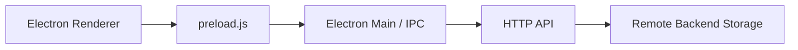

# Crafting Table

一个基于 Electron 的开发工作台客户端，现已改成前后端分离模式。

- Electron 客户端负责界面、交互和本地接口配置
- 工作台数据通过 HTTP 接口从远端后端读取和保存
- 用户可以在客户端里自行配置后台服务器地址

## 当前能力

- 今日安排编辑
- 临时收集项新增、编辑、删除
- 项目卡片新增、复制、删除、拖拽排序
- 深色 / 浅色 / 跟随系统主题切换
- 后台接口地址配置
- 接口连通性测试
- 远端工作台状态自动保存

说明：前端原有的导入 / 导出功能已经移除，工作台内容不再存本地数据库。

## 架构说明



当前仓库内包含两部分：

- Electron 客户端
- 一个最小可运行的示例后端，便于本地联调

## 目录结构

```text
crafting-table/
├── assets/
│   ├── icon.icns           # macOS 应用 / DMG 图标
│   └── logo.png            # 页面内使用的 logo
├── backend/
│   └── server.js           # 示例后端
├── demo.html               # 原始界面 demo
├── forge.config.js         # Electron Forge 打包配置
├── main.js                 # Electron 主进程入口
├── preload.js              # 渲染层桥接 API
├── renderer/
│   ├── index.html          # 客户端页面
│   ├── renderer.js         # 前端状态与远端同步逻辑
│   └── style.css           # 页面样式
├── src/
│   ├── database.js         # 本地客户端配置存储
│   └── ipc-handlers.js     # IPC 与远端 API 请求
├── package.json
└── LICENSE
```

## 技术栈

- Electron `^41.0.0`
- Node.js
- SQLite
- Node 内置 [`node:sqlite`](https://nodejs.org/api/sqlite.html)
- 原生 HTML / CSS / JavaScript
- 示例后端：Node.js `http` 模块

说明：

- Electron 本地 SQLite 现在只保存客户端配置，例如后台服务器地址
- 工作台业务数据由远端接口负责
- `node:sqlite` 在当前 Node / Electron 版本下仍会输出实验性警告，属于当前实现的预期行为

## 快速开始

### 1. 安装依赖

```bash
npm install
```

### 2. 启动示例后端

```bash
npm run backend:start
```

默认监听地址：

```text
http://127.0.0.1:8787
```

### 3. 启动 Electron 客户端

```bash
npm start
```

客户端默认会读取本地保存的接口地址；首次运行时默认地址为：

```text
http://127.0.0.1:8787
```

如果你有自己的后端服务，可以在客户端右上角打开“接口配置”并修改服务器地址。

## 可用脚本

```bash
npm start
npm run backend:start
npm run package
npm run make
npm run make:dmg
```

- `npm start`：启动 Electron 客户端
- `npm run backend:start`：启动仓库内置的示例后端
- `npm run package`：生成未压缩应用目录
- `npm run make`：生成配置好的分发包
- `npm run make:dmg`：仅生成 macOS `.dmg` 安装包

## 接口配置说明

客户端提供“接口配置”弹窗，允许用户填写自己的后台服务器地址。

填写的是服务根地址，例如：

```text
http://127.0.0.1:8787
https://your-domain.com
```

客户端会基于这个地址请求以下接口：

- `GET /api/health`
- `GET /api/workbench-state`
- `PUT /api/workbench-state`

也就是说，如果用户把服务器地址配置为：

```text
https://example.com
```

那么客户端实际会访问：

- `https://example.com/api/health`
- `https://example.com/api/workbench-state`

## 示例后端说明

仓库内置的示例后端文件是 [backend/server.js](./backend/server.js)。

它的行为很简单：

- `GET /api/health`：健康检查
- `GET /api/workbench-state`：读取工作台状态
- `PUT /api/workbench-state`：保存工作台状态

示例后端默认把数据保存到：

```text
backend-data/workbench-state.json
```

这个目录已加入 `.gitignore`，不会被提交。

## 本地配置存储

Electron 客户端仍会使用本地 SQLite，但用途已经变成“客户端配置”，不是业务数据存储。

数据库文件位于 Electron `userData` 目录下，文件名为：

```text
crafting-table.db
```

当前本地主要保存的是：

- 后台服务器地址 `apiBaseUrl`

## 打包说明

项目已经接入 Electron Forge。

### 生成未压缩应用

```bash
npm run package
```

当前在这台 macOS / Apple Silicon 环境里，产物会输出到：

```text
out/crafting-table-darwin-arm64/
```

### 生成分发包

```bash
npm run make
```

这个命令会执行当前已配置的 maker，包括：

- ZIP
- DMG（仅在 macOS 上可构建）

当前版本的 ZIP 产物会输出到：

```text
out/make/zip/darwin/arm64/crafting-table-darwin-arm64-1.0.0.zip
```

当前版本的 DMG 产物会输出到：

```text
out/make/crafting-table-1.0.0-arm64.dmg
```

### 仅生成 DMG 安装包

```bash
npm run make:dmg
```

这个命令等价于只跑 Electron Forge 的 DMG maker，适合 macOS 发布前单独出安装包。

当前版本在 macOS 上生成的 DMG 路径为：

```text
out/make/crafting-table-1.0.0-arm64.dmg
```

### 当前打包边界

- 当前已接入 ZIP 和 DMG maker
- DMG 只能在 macOS 上构建
- 还没有接入 `msi`、`deb` 等其他安装器
- 还没有配置应用签名和 notarization
- 已配置自定义应用图标：`assets/icon.icns`
- 默认只针对当前系统和当前架构打包

## 验证情况

- 已通过 `node --check` 校验主进程、IPC、渲染层和示例后端脚本语法
- 已执行 `npm run backend:start`，示例后端可正常启动
- 已验证 `GET /api/health`
- 已验证 `GET /api/workbench-state`
- 已验证 `PUT /api/workbench-state`
- 已执行 `npm start`，Electron 客户端可启动
- 已执行 `npm run package`
- 已执行 `npm run make`
- 已执行 `npm run make:dmg`

## License

MIT
